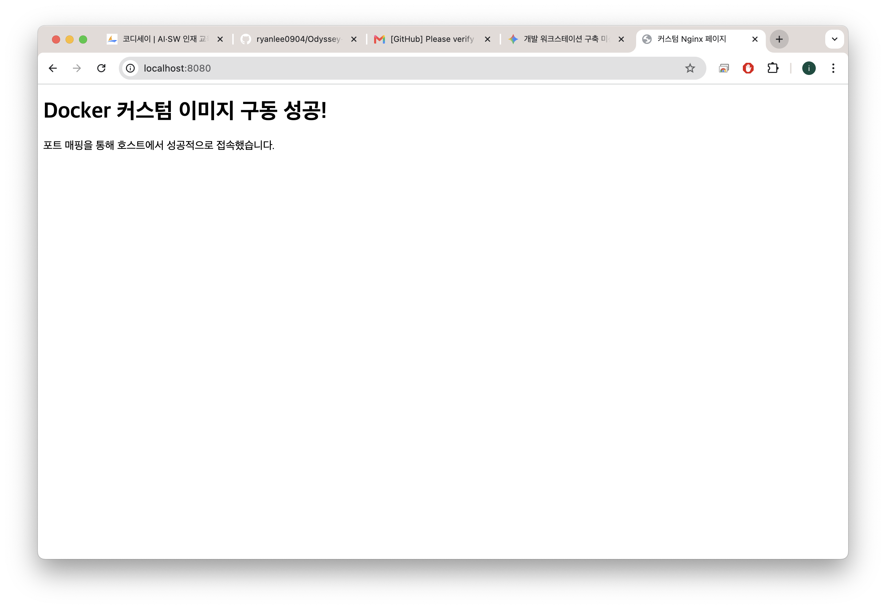
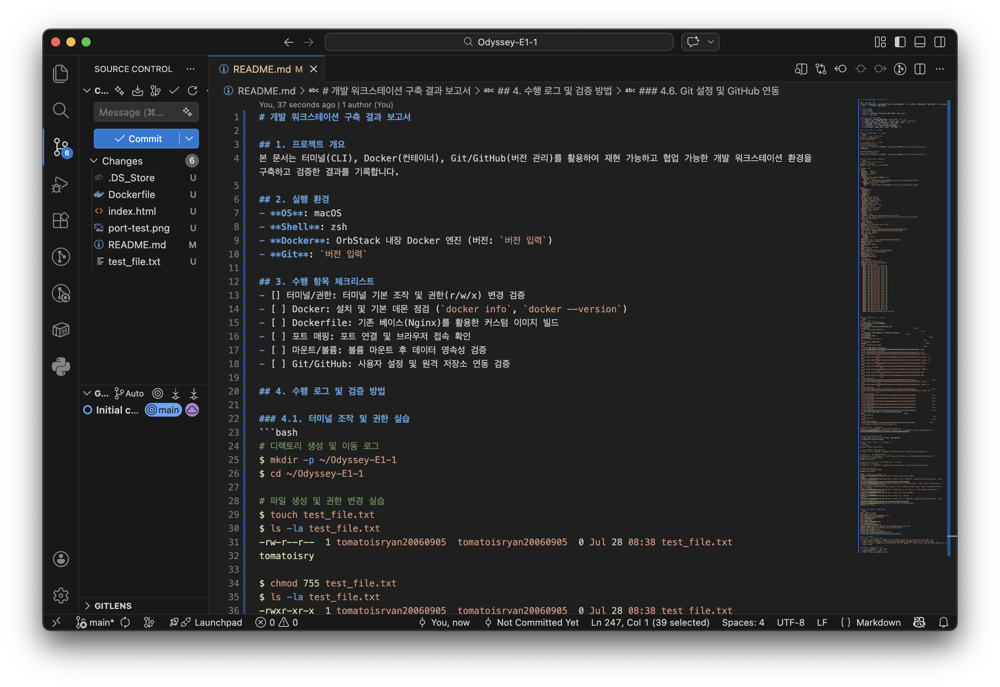

# 개발 워크스테이션 구축 결과 보고서

## 1. 프로젝트 개요
본 문서는 터미널(CLI), Docker(컨테이너), Git/GitHub(버전 관리)를 활용하여 재현 가능하고 협업 가능한 개발 워크스테이션 환경을 구축하고 검증한 결과를 기록합니다.

## 2. 실행 환경
- **OS**: macOS
- **Shell**: zsh
- **Docker**: OrbStack 내장 Docker 엔진 (버전: `버전 입력`)
- **Git**: `버전 입력`

## 3. 수행 항목 체크리스트
- [] 터미널/권한: 터미널 기본 조작 및 권한(r/w/x) 변경 검증
- [ ] Docker: 설치 및 기본 데몬 점검 (`docker info`, `docker --version`)
- [ ] Dockerfile: 기존 베이스(Nginx)를 활용한 커스텀 이미지 빌드
- [ ] 포트 매핑: 포트 연결 및 브라우저 접속 확인
- [ ] 마운트/볼륨: 볼륨 마운트 후 데이터 영속성 검증
- [ ] Git/GitHub: 사용자 설정 및 원격 저장소 연동 검증

## 4. 수행 로그 및 검증 방법

### 4.1. 터미널 조작 및 권한 실습
```bash
# 디렉토리 생성 및 이동 로그
$ mkdir -p ~/Odyssey-E1-1
$ cd ~/Odyssey-E1-1

# 파일 생성 및 권한 변경 실습
$ touch test_file.txt
$ ls -la test_file.txt
-rw-r--r--  1 tomatoisryan20060905  tomatoisryan20060905  0 Jul 28 08:38 test_file.txt
tomatoisry

$ chmod 755 test_file.txt
$ ls -la test_file.txt
-rwxr-xr-x  1 tomatoisryan20060905  tomatoisryan20060905  0 Jul 28 08:38 test_file.txt
```

### 4.2. Docker 설치 및 기본 점검
```bash
# Docker 버전 및 데몬 상태 점검
$ docker --version
Docker version 28.5.2, build ecc6942

$ docker info
Client:
 Version:    28.5.2
 Context:    orbstack
 Debug Mode: false
 Plugins:
  buildx: Docker Buildx (Docker Inc.)
    Version:  v0.29.1
    Path:     /Users/tomatoisryan20060905/.docker/cli-plugins/docker-buildx
  compose: Docker Compose (Docker Inc.)
    Version:  v2.40.3
    Path:     /Users/tomatoisryan20060905/.docker/cli-plugins/docker-compose

Server:
 Containers: 0
  Running: 0
  Paused: 0
  Stopped: 0
 Images: 0
 Server Version: 28.5.2
 Storage Driver: overlay2
  Backing Filesystem: btrfs
  Supports d_type: true
  Using metacopy: false
  Native Overlay Diff: true
  userxattr: false
 Logging Driver: json-file
 Cgroup Driver: cgroupfs
 Cgroup Version: 2
 Plugins:
  Volume: local
  Network: bridge host ipvlan macvlan null overlay
  Log: awslogs fluentd gcplogs gelf journald json-file local splunk syslog
 CDI spec directories:
  /etc/cdi
  /var/run/cdi
 Swarm: inactive
 Runtimes: io.containerd.runc.v2 runc
 Default Runtime: runc
 Init Binary: docker-init
 containerd version: 1c4457e00facac03ce1d75f7b6777a7a851e5c41
 runc version: d842d7719497cc3b774fd71620278ac9e17710e0
 init version: de40ad0
 Security Options:
  seccomp
   Profile: builtin
  cgroupns
 Kernel Version: 6.17.8-orbstack-00308-g8f9c941121b1
 Operating System: OrbStack
 OSType: linux
 Architecture: x86_64
 CPUs: 6
 Total Memory: 15.67GiB
 Name: orbstack
 ID: 9222b9fc-fa21-401b-a31c-dca245f41047
 Docker Root Dir: /var/lib/docker
 Debug Mode: false
 Experimental: false
 Insecure Registries:
  ::1/128
  127.0.0.0/8
 Live Restore Enabled: false
 Product License: Community Engine
 Default Address Pools:
   Base: 192.168.97.0/24, Size: 24
   Base: 192.168.107.0/24, Size: 24
   Base: 192.168.117.0/24, Size: 24
   Base: 192.168.147.0/24, Size: 24
   Base: 192.168.148.0/24, Size: 24
   Base: 192.168.155.0/24, Size: 24
   Base: 192.168.156.0/24, Size: 24
   Base: 192.168.158.0/24, Size: 24
   Base: 192.168.163.0/24, Size: 24
   Base: 192.168.164.0/24, Size: 24
   Base: 192.168.165.0/24, Size: 24
   Base: 192.168.166.0/24, Size: 24
   Base: 192.168.167.0/24, Size: 24
   Base: 192.168.171.0/24, Size: 24
   Base: 192.168.172.0/24, Size: 24
   Base: 192.168.181.0/24, Size: 24
   Base: 192.168.183.0/24, Size: 24
   Base: 192.168.186.0/24, Size: 24
   Base: 192.168.207.0/24, Size: 24
   Base: 192.168.214.0/24, Size: 24
   Base: 192.168.215.0/24, Size: 24
   Base: 192.168.216.0/24, Size: 24
   Base: 192.168.223.0/24, Size: 24
   Base: 192.168.227.0/24, Size: 24
   Base: 192.168.228.0/24, Size: 24
   Base: 192.168.229.0/24, Size: 24
   Base: 192.168.237.0/24, Size: 24
   Base: 192.168.239.0/24, Size: 24
   Base: 192.168.242.0/24, Size: 24
   Base: 192.168.247.0/24, Size: 24
   Base: fd07:b51a:cc66:d000::/56, Size: 64

```

### 4.3. Dockerfile 빌드 및 실행
```bash
# 커스텀 이미지 빌드
$ docker build -t my-nginx:1.0 .
[+] Building 6.5s (7/7) FINISHED                                                                    docker:orbstack
 => [internal] load build definition from Dockerfile                                                           0.1s
 => => transferring dockerfile: 722B                                                                           0.0s
 => [internal] load metadata for docker.io/library/nginx:alpine                                                2.4s
 => [internal] load .dockerignore                                                                              0.1s
 => => transferring context: 2B                                                                                0.0s
 => [internal] load build context                                                                              0.2s
 => => transferring context: 324B                                                                              0.0s
 => [1/2] FROM docker.io/library/nginx:alpine@sha256:4a73073bd557c65b759505da037898b61f1be6cbcc3c2c3aeac22d2a  3.0s
 => => resolve docker.io/library/nginx:alpine@sha256:4a73073bd557c65b759505da037898b61f1be6cbcc3c2c3aeac22d2a  0.2s
 => => sha256:1d40e3eb3bf4f138de1d67193f2aa5309fcaf343eb5ffadbf5e9439de1eb1ebb 2.50kB / 2.50kB                 0.0s
 => => sha256:4a73073bd557c65b759505da037898b61f1be6cbcc3c2c3aeac22d2a470c1752 10.33kB / 10.33kB               0.0s
 => => sha256:f0ba77f796e57c6fa89ae7f4fdad1665d6fcbd8e3f211535120542b337f9959e 12.32kB / 12.32kB               0.0s
 => => sha256:3cd534fe98c64d68a1f4f1c83abb8d5cba7ecfd7be88e592389929d12e6253da 1.89MB / 1.89MB                 0.3s
 => => sha256:1223f016b4e4a2c21f7c49d4837fbfd47a9da6436b511690ca1e582fc2810d59 627B / 627B                     0.4s
 => => sha256:55afa1ecc21d2bb5e5045f32dafee56272ffd89860bac26f6c32123439af26a4 3.85MB / 3.85MB                 0.7s
 => => sha256:62bec68d7c31c4c8a19d812d84da5f7748e54690c037979945b6c5b6c924b142 957B / 957B                     0.7s
 => => sha256:46f977ee452f4399c208714afa034868d6056864f8a0cf3c643ab143dd802c80 404B / 404B                     0.8s
 => => extracting sha256:55afa1ecc21d2bb5e5045f32dafee56272ffd89860bac26f6c32123439af26a4                      0.1s
 => => sha256:d0008c891db48b5f526d914bce9e8d889fe1a9d1f08291ae03fe97f871726f38 1.21kB / 1.21kB                 1.0s
 => => sha256:390dc935348d8070e695fbaae2a4bb114fb9e69c59f628e7576036ee9d5244c9 1.40kB / 1.40kB                 1.0s
 => => extracting sha256:3cd534fe98c64d68a1f4f1c83abb8d5cba7ecfd7be88e592389929d12e6253da                      0.1s
 => => sha256:46519e7231d2eb5604df229beb44d59719a489eaa7aca52982535a010b07a9ed 20.31MB / 20.31MB               1.4s
 => => extracting sha256:1223f016b4e4a2c21f7c49d4837fbfd47a9da6436b511690ca1e582fc2810d59                      0.0s
 => => extracting sha256:62bec68d7c31c4c8a19d812d84da5f7748e54690c037979945b6c5b6c924b142                      0.0s
 => => extracting sha256:46f977ee452f4399c208714afa034868d6056864f8a0cf3c643ab143dd802c80                      0.0s
 => => extracting sha256:d0008c891db48b5f526d914bce9e8d889fe1a9d1f08291ae03fe97f871726f38                      0.0s
 => => extracting sha256:390dc935348d8070e695fbaae2a4bb114fb9e69c59f628e7576036ee9d5244c9                      0.0s
 => => extracting sha256:46519e7231d2eb5604df229beb44d59719a489eaa7aca52982535a010b07a9ed                      0.4s
 => [2/2] COPY index.html /usr/share/nginx/html/index.html                                                     0.3s
 => exporting to image                                                                                         0.2s
 => => exporting layers                                                                                        0.1s
 => => writing image sha256:5da4f1b95a820395e8887a619bf25c3ff2ed3823045710fe05a4a7c62674d61f                   0.0s
 => => naming to docker.io/library/my-nginx:1.0                                  

# 컨테이너 실행 및 포트 매핑
$ docker run -d -p 8080:80 --name my-web my-nginx:1.0
tomatoisryan20060905@c4r7s8 Odyssey-E1-1 % docker run -d -p 8080:80 --name my-web my-nginx:1.0
6adc2c8ab7d41f0bdcb73950dc7ec7adf7b410ac45188cefa5b08825945faa74
```

### 4.4. 포트 매핑 접속 증거
- 브라우저에서 `http://localhost:8080` 접속 스크린샷 


### 4.5. 바인드 마운트 및 볼륨 영속성 검증
```bash
# 볼륨 생성
$ docker volume create mydata

# 볼륨을 연결하여 컨테이너 실행
$ docker run -d -p 8081:80 -v mydata:/usr/share/nginx/html --name vol-test my-nginx:1.0

# 컨테이너 내부에 접속하여 데이터 변경
$ docker exec -it vol-test sh -c "echo 'Volume Test Success' > /usr/share/nginx/html/index.html"
$ curl http://localhost:8081
Volume Test Success

# 컨테이너 삭제 후 새로운 컨테이너에 동일한 볼륨 연결
$ docker rm -f vol-test
$ docker run -d -p 8082:80 -v mydata:/usr/share/nginx/html --name vol-test2 my-nginx:1.0

# 데이터 영속성 확인
$ curl http://localhost:8082
Volume Test Success

바인드 마운트 및 볼륨 영속성 검증 
tomatoisryan20060905@c4r7s8 Odyssey-E1-1 % docker volume create mydata
mydata
tomatoisryan20060905@c4r7s8 Odyssey-E1-1 % docker run -d -p 8081:80 -v mydata:/usr/share/nginx/html --name vol-test my-nginx:1.0
4977ae4536068ad2948d6f6af06cb7c6ff2931b4567543213137590770f84b92
tomatoisryan20060905@c4r7s8 Odyssey-E1-1 % docker exec -it vol-test bash -c "echo 'Volume Test Success' > /usr/share/nginx/html/index.html"
OCI runtime exec failed: exec failed: unable to start container process: exec: "bash": executable file not found in $PATH
tomatoisryan20060905@c4r7s8 Odyssey-E1-1 % docker exec -it vol-test sh -c "echo 'Volume Test Success' > /usr/share/nginx/html/index.html"
tomatoisryan20060905@c4r7s8 Odyssey-E1-1 % curl http://localhost:8081    
Volume Test Success
tomatoisryan20060905@c4r7s8 Odyssey-E1-1 % docker rm -f vol-test
vol-test
tomatoisryan20060905@c4r7s8 Odyssey-E1-1 % docker run -d -p 8082:80 -v mydata:/usr/share/nginx/html --name vol-test2 my-nginx:1.0
c866d2dbca046b05f3be7eb50638405e78fc7ebad96acd5288f2c58232d8cdd7
tomatoisryan20060905@c4r7s8 Odyssey-E1-1 % curl http://localhost:8082
Volume Test Success
```

### 4.6. Git 설정 및 GitHub 연동
```bash
$ git config --list
user.name=ryanlee0904
user.email=tomatoisryan2006@gmail.com
core.repositoryformatversion=0
core.filemode=true
core.bare=false
core.logallrefupdates=true
core.ignorecase=true
core.precomposeunicode=true
remote.origin.url=https://github.com/ryanlee0904/Odyssey-E1-1.git
remote.origin.fetch=+refs/heads/*:refs/remotes/origin/*
branch.main.remote=origin
branch.main.merge=refs/heads/main
branch.main.vscode-merge-base=origin/main
```


## 5. 트러블슈팅
### Issue 1: (문제 상황 제목)
- **문제**: 컨테이너 실행 시 `Bind for 0.0.0.0:8080 failed: port is already allocated` 에러 발생.
- **원인 가설**: 이전에 실행한 컨테이너나 다른 프로세스가 이미 8080 포트를 점유하고 있을 것이다.
- **확인 및 해결**: `docker ps`로 기존 컨테이너 확인 후 `docker rm -f <컨테이너명>`으로 삭제하거나 매핑 포트를 `8081:80`으로 변경하여 해결함.

### Issue 2: (문제 상황 제목)
### Issue 2: Alpine 리눅스 기반 컨테이너 bash 실행 오류
- **문제**: 볼륨 실습 중 컨테이너 내부 데이터를 수정하기 위해 `docker exec -it vol-test bash -c ...` 명령어를 실행했으나, `executable file not found in $PATH` 에러가 발생함.
- **원인 가설**: 사용 중인 `my-nginx` 이미지의 베이스가 `nginx:alpine` 버전이라서, 용량을 줄이기 위해 무거운 `bash` 쉘 대신 가벼운 기본 쉘만 들어있을 것이다.
- **확인 및 해결**: `bash` 대신 Alpine 리눅스에 기본으로 내장된 쉘인 `sh`를 사용하여 `docker exec -it vol-test sh -c ...`로 명령어를 수정해 실행하니 에러 없이 정상적으로 작동함.
